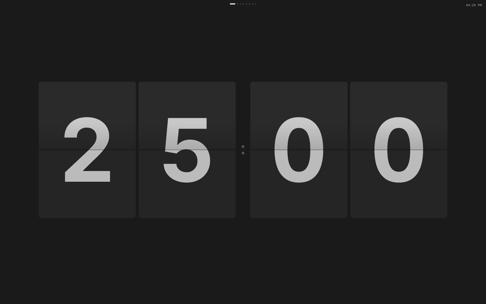
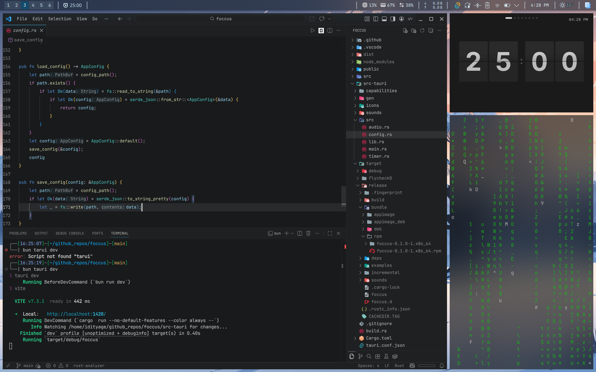
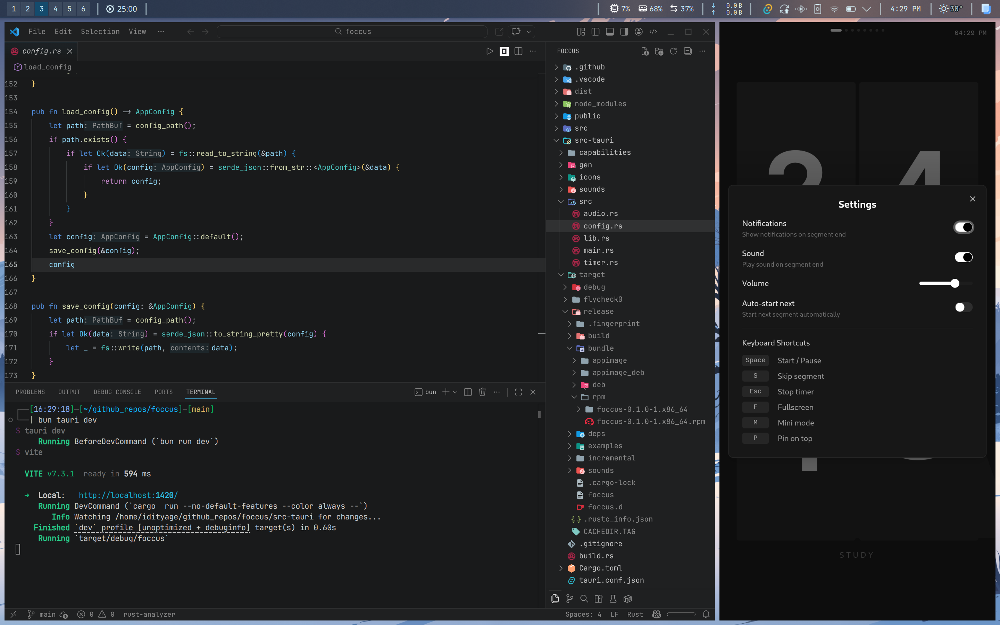

# Foccus

A minimal Pomodoro timer for Linux with a retro flip-clock display.





## Features

- Retro flip-clock animation
- Customizable work/break sessions
- Built-in presets (Classic Pomodoro, Short Focus, Deep Work)
- Desktop notifications with sound
- System tray integration
- Mini mode for a compact view
- Keyboard shortcuts
- Always-on-top option

## Installation

### Download

Check the [Releases](https://github.com/idityaGE/foccus/releases) page for pre-built packages:

| System | Package |
|--------|---------|
| Fedora, RHEL, openSUSE | `.rpm` |
| Ubuntu, Debian | `.deb` |
| Arch Linux | `.pkg.tar.zst` |
| Any Linux | `.AppImage` |

### Build from Source

**Prerequisites:**
- [Rust](https://rustup.rs/)
- [Bun](https://bun.sh/) (or npm/pnpm)
- Linux dependencies for Tauri: `webkit2gtk`, `gtk3`, `libayatana-appindicator`

```bash
# Clone the repository
git clone https://github.com/idityaGE/foccus.git
cd foccus

# Install dependencies
bun install

# Build
bun run tauri build
```

The built package will be in `src-tauri/target/release/bundle/`.

## Keyboard Shortcuts

| Key | Action |
|-----|--------|
| `Space` | Start / Pause |
| `S` | Skip segment |
| `Esc` | Stop timer |
| `F` | Toggle fullscreen |
| `M` | Toggle mini mode |
| `P` | Pin on top |

## Contributing

See [CONTRIBUTING.md](CONTRIBUTING.md) for guidelines.

## License

[MIT](LICENSE.md)
